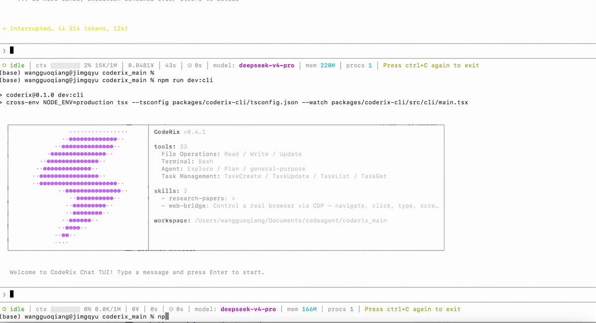

# Coderix

<div align="center">

[](LICENSE)
[](https://nodejs.org)
[](https://www.typescriptlang.org/)
[](README.md)

**一个完全开源（Apache 2.0）的终端 AI 编程助手 —— Claude Code 的自由替代品。**

</div>

<div align="center">

</div>

Coderix 是一个强大的 AI 编程助手，可在终端或桌面应用中使用。它能够读取、写入、编辑文件，执行 Shell 命令，搜索代码等等——全部通过自然语言对话完成。基于 Ink/React 构建，拥有精美的终端界面（TUI 版），同时提供共用同一核心引擎的 Electron 桌面版（React DOM + Monaco + xterm）。

---

## 为什么选择 Coderix？

|  | Claude Code | Coderix |
|---|---|---|
| **许可证** | 闭源商业许可 | Apache 2.0 开源 |
| **源代码** | 不公开 | 完全开放 |
| **模型提供商** | 仅 Anthropic | Anthropic / DeepSeek / OpenAI |
| **计费方式** | 按 Token 付费 | 自带 API Key |
| **可扩展性** | 有限 | 完整的插件架构 |

---

## 快速开始

### 环境要求

- **Node.js >= 22**
- 一个 API Key：[DeepSeek](https://platform.deepseek.com)、[Anthropic](https://console.anthropic.com) 或 [OpenAI](https://platform.openai.com)

### 安装

```bash
git clone https://github.com/AgenticMatrix/coderix.git
cd coderix
./install.sh --local
```

### 开发模式

Coderix 提供两种界面，共用同一套核心引擎：

| 命令 | 界面 |
|---|---|
| `npm run dev:cli` | **TUI 版** —— 终端界面（Ink/React） |
| `npm run dev:desk` | **桌面版** —— Electron 应用（React DOM） |

```bash
# TUI 版（终端界面）
npm run dev:cli

# 桌面版（Electron）
npm run dev:desk

# 桌面版（一键启动，自动释放 5173 端口）
./start_desk.sh
```

### 配置

```bash
# 首次运行配置向导
coderix setup

# 或者手动编辑 ~/.coderix/settings.json
```

### 开始使用

```bash
# 交互式会话
coderix

# 单次查询
coderix --print "解释 src/core/query-engine.ts 这个文件"

# 切换模型
coderix --model
coderix -m "deepseek/deepseek-v4-pro"
```

---

## 功能特性

- **精美的终端界面** — 基于 [Ink](https://github.com/vadimdemedes/ink) + React 19 构建，完全终端渲染
- **多模型支持** — Anthropic (Claude)、DeepSeek、OpenAI 兼容接口
- **15+ 内置工具** — 读取、写入、编辑、Shell 执行、代码搜索、文件搜索、网页抓取、网页搜索、任务管理、待办事项
- **流式工具队列** — 工具在 LLM 流式解析时即时加入队列并执行，支持有界并发（默认 32）
- **流式输出** — 实时文本、思考过程和工具调用流式传输
- **Agent 循环** — 自主多轮推理与工具调用执行
- **权限系统** — plan / ask / auto 三种模式，按风险等级分类
- **上下文管理** — Token 预算追踪和自动压缩
- **Hook 钩子系统** — 可扩展的生命周期钩子
- **技能模块** — 可插拔的技能插件
- **会话管理** — 检查点保存、恢复、分支会话
- **模型选择器** — 交互式终端模型选择（`coderix --model` / `coderix setup`）
- **桌面应用** — Electron 桌面客户端，内置 Monaco 编辑器、xterm 终端和源代码管理

---

## 键盘快捷键

| 快捷键 | 功能 |
|---|---|
| `Enter` | 发送消息 |
| `Escape` | 清空输入 / 关闭子 Agent 视图 |
| `Ctrl+C` | 中断 Agent / 终止子 Agent / 清空输入 / 双击退出 |
| `Ctrl+B` | 将子 Agent 转入后台（解除主 Agent 阻塞，子 Agent 继续运行） |
| `Ctrl+T` | 切换子 Agent 对话视图 |
| `Ctrl+P` | 切换任务和待办面板 |
| `Ctrl+O` | 展开/折叠所有内容块 |
| `Ctrl+K` | 切换团队选择器 |
| `Ctrl+Enter` | 插入换行 |
| `↑ / ↓` | 浏览输入历史 |
| `← / →` | 移动光标 |
| `Tab` | 自动补全斜杠命令 |
| `PageUp / PageDown` | 冻结 / 取消冻结显示 |

---

## 配置说明

编辑 `~/.coderix/settings.json`：

```json
{
  "model_list": [
    {
      "model": [
        {
          "name": "deepseek-v4-pro",
          "price": {
            "input": 3,
            "cache_read_input": 0.025,
            "output": 6,
            "currency": "CNY",
            "unit": 1000000,
            "concurrency": 500,
            "max_context": 1000000
          }
        },
        {
          "name": "deepseek-v4-flash",
          "price": {
            "input": 1,
            "cache_read_input": 0.02,
            "output": 2,
            "currency": "CNY",
            "unit": 1000000,
            "concurrency": 2500,
            "max_context": 1000000
          }
        }
      ],
      "provider": "deepseek",
      "base_url": "https://api.deepseek.com/anthropic",
      "auth_token_env": "你的DeepSeek API Key"
    },
    {
      "model": [
        "claude-sonnet-2025",
        "opus-4.8"
      ],
      "provider": "anthropic",
      "base_url": "https://api.deepseek.com/anthropic",
      "auth_token_env": "你的Anthropic API Key",
      "price": {
        "input": 3,
        "output": 15,
        "currency": "USD",
        "unit": "1M tokens"
      }
    },
    {
      "model": [
        "gpt-5",
        "gpt-5-mini"
      ],
      "provider": "openai",
      "base_url": "https://api.openai.com/v1",
      "auth_token_env": "你的OpenAI API Key"
    }
  ],
  "default_model": "deepseek/deepseek-v4-pro",
  "max_tool_concurrency": 32,
  "theme": "dark"
}
```

---

## CLI 命令参考

| 命令 | 说明 |
|---|---|
| `coderix` | 启动交互式会话 |
| `coderix "问题"` | 单次提问 |
| `coderix --help` | 显示帮助信息 |
| `coderix --version` | 输出版本号 |
| `coderix --model` | 交互式模型选择器 |
| `coderix -m "provider/model"` | 直接指定模型 |
| `coderix setup` | 首次配置向导 |

---

## 项目结构

```
Coderix/
├── src/
│   ├── cli/           # CLI 入口，终端渲染组件
│   ├── core/          # 核心引擎：Agent 循环、查询处理、上下文管理
│   ├── provider/      # 模型提供商适配器（Anthropic、DeepSeek、OpenAI）
│   ├── tools/         # 内置工具（文件读写、Bash、搜索等）
│   ├── commands/      # 斜杠命令
│   ├── skills/        # 技能插件系统
│   ├── state/         # 会话状态管理
│   ├── desktop/       # Electron 桌面应用
│   ├── agents/        # 子 Agent 系统
│   └── api/           # API 端点
├── docs/              # 文档
├── tests/             # 测试
└── config/            # 默认配置
```

---

## 开源协议

[Apache 2.0](LICENSE) —— 完全开源。自由使用、修改、发布。
